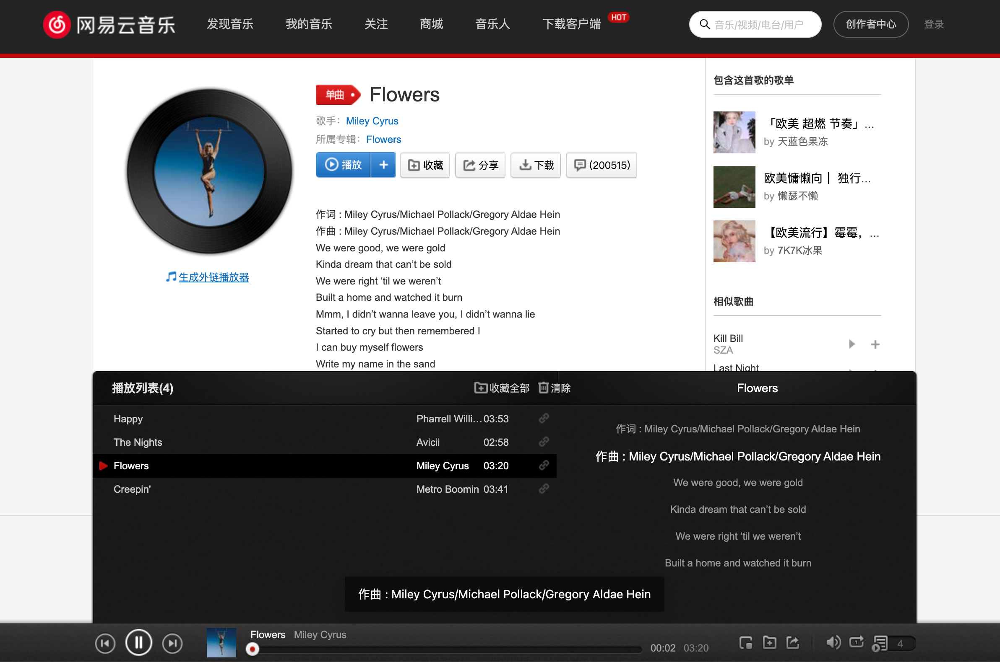
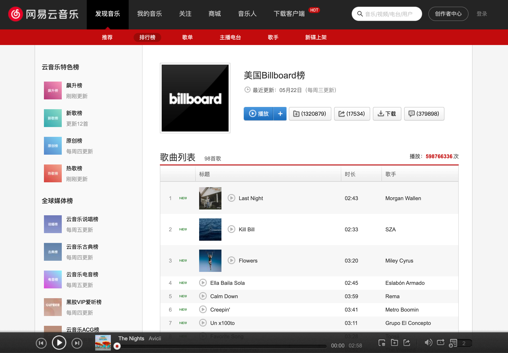
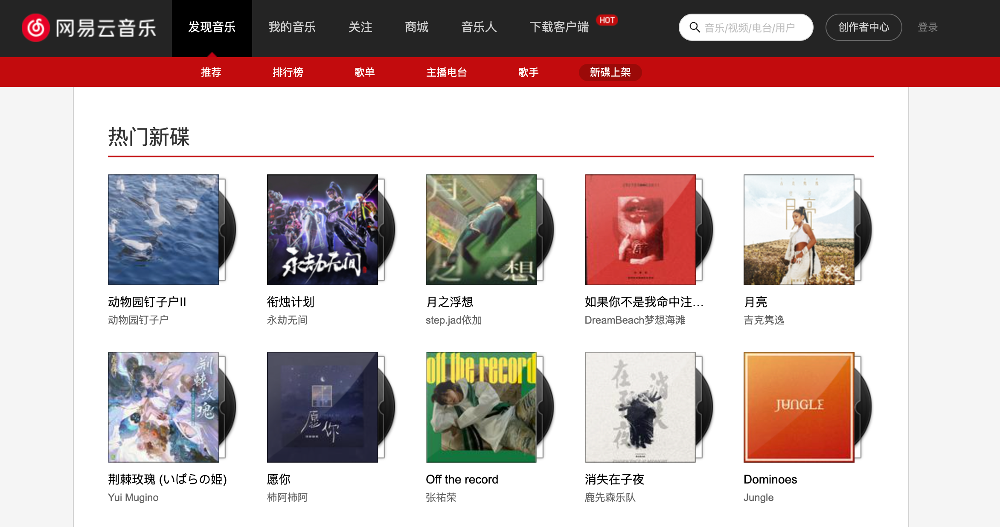
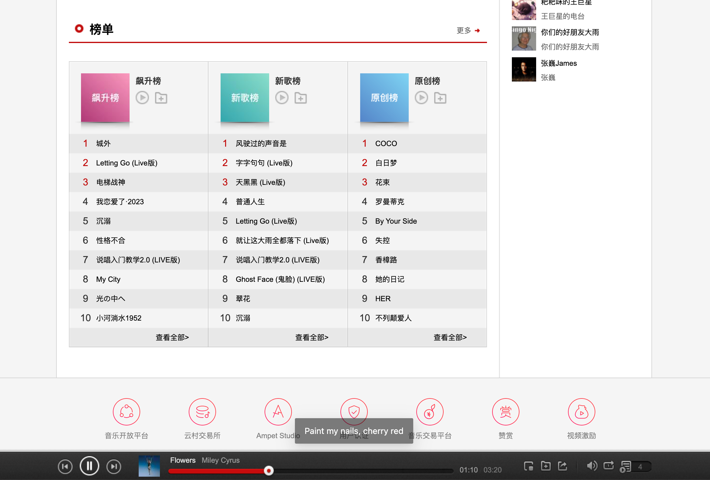

## 技术栈

- Rreact 18 + Type script 4.x 实现音乐网页

## 实现功能

- 推荐、排行榜、歌单、主播电台、歌手和新碟上架等页面获取并展示数据；
- 榜单内歌曲可添加到播放列表，并播放歌曲；
- 可查看列表歌曲、当前播放歌曲的歌词；
- 可切换播放列表歌曲，并支持顺序、单曲、乱序播放；
- 主播电台、歌手等页面将参数绑定至 URL，可通过 URL 直接打开对应页面的详情数据。

## 待实现功能

- 歌曲搜索功能；
- 歌单的添加和播放列表的整体替换；
- 歌曲详情页与URL地址栏的联动问题；
- more ...

## 相关图片

### 首页轮播图：

### 歌曲详情、歌词内容滚动：

### 排行榜：

### 热门新碟：

### 榜单：

### ：

